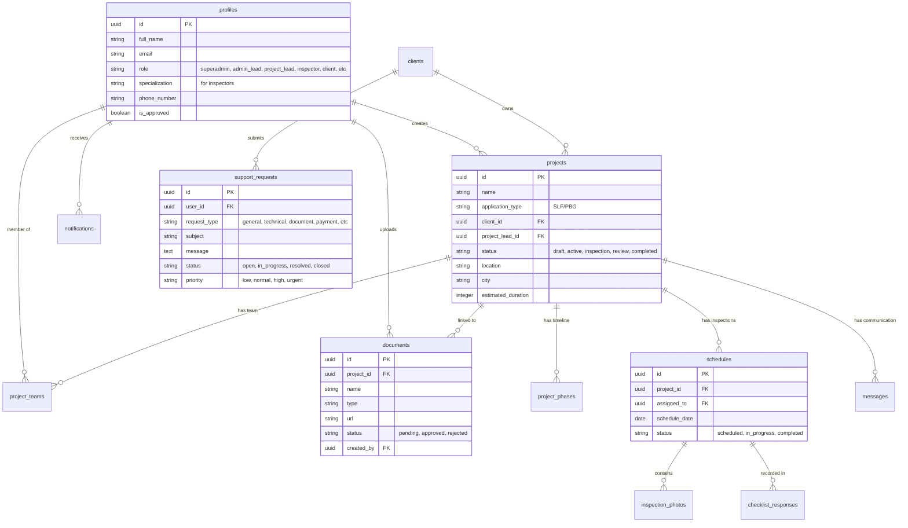
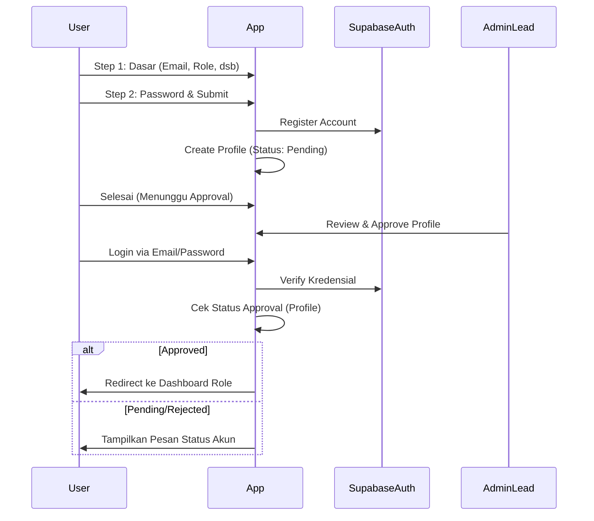
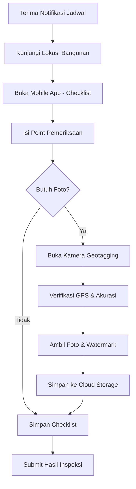

# SLF One Manager - System Documentation

Dokumentasi komprehensif untuk sistem manajemen Sertifikat Laik Fungsi (SLF) dan Persetujuan Bangunan Gedung (PBG).

## 1. Arsitektur Sistem

SLF One Manager dibangun menggunakan teknologi modern berbasis cloud untuk memastikan performa tinggi, skalabilitas, dan kemudahan pemeliharaan.

- **Frontend**: [Next.js](https://nextjs.org/) (React Framework)
- **Styling**: [Tailwind CSS](https://tailwindcss.com/) dengan komponen [Shadcn UI](https://ui.shadcn.com/)
- **Backend/Database**: [Supabase](https://supabase.com/) (PostgreSQL dengan RLS dan Auth Helpers)
- **Realtime**: Supabase Realtime untuk notifikasi dan chat
- **Storage**: Supabase Storage untuk penyimpanan dokumen dan foto inspeksi
- **PDF Generation**: [@react-pdf/renderer](https://react-pdf.org/) untuk pembuatan laporan formal

---

## 2. Entity Relationship Diagram (ERD)

Berikut adalah struktur data utama dan hubungan antar tabel dalam sistem:



---

## 3. Alur Sistem (Detailed Flows)

### 3.1 Registrasi & Login
Sistem menggunakan alur registrasi bertahap dan login berbasis persetujuan (approval-based access control) untuk memastikan hanya personil dan klien yang valid yang dapat mengakses dashboard perusahaan.

#### 3.1.1 Alur Registrasi (2-Step Process)
Pendaftaran dilakukan melalui halaman `/register` dengan alur sebagai berikut:
1.  **Langkah 1: Informasi Dasar**: Pengguna mengisi Nama Lengkap, Email, Role (Client, Inspector, dsb), Nomor Telepon, dan Nama Perusahaan.
    - Khusus untuk role **Inspector**, pengguna wajib memilih **Spesialisasi** (Arsitektur, Struktur, Elektrikal, dsb).
2.  **Langkah 2: Keamanan**: Pengguna membuat password dengan indikator kekuatan password (minimal 8 karakter, kombinasi huruf besar/kecil, angka, dan karakter spesial).
3.  **Database Sync**: Setelah menekan daftar, sistem akan:
    - Membuat user di `supabase.auth`.
    - Mengirimkan email konfirmasi.
    - Membuat entri di tabel `profiles` dengan status `pending` dan `is_approved = false` melalui `/api/auth/create-profile`.
4.  **Awaiting Approval**: Pengguna diarahkan ke halaman `/awaiting-approval` untuk menunggu verifikasi email dan approval manual dari Superadmin.

#### 3.1.2 Alur Login & Redireksi
Proses masuk ke sistem di halaman `/login` memiliki mekanisme validasi berlapis:
- **Verifikasi Kredensial**: Menggunakan email dan password.
- **Email Verification Check**: Sistem menolak login jika email belum dikonfirmasi melalui link yang dikirimkan.
- **Approval Status Check**: Meskipun email sudah diverifikasi, pengguna tidak dapat masuk jika status di profil masih `pending`, `rejected`, atau `suspended`.
- **Role-Based Redirect**: Setelah berhasil login, `AuthContext` akan mengarahkan pengguna ke dashboard yang sesuai secara otomatis:
    - `superadmin`: `/dashboard/superadmin`
    - `admin_lead`: `/dashboard/admin-lead`
    - `inspector`: `/dashboard/inspector`
    - `client`: `/dashboard/client`
    - Dst.



### 3.2 Lupa Password & Reset Password
Sistem menyediakan pemulihan akun yang mandiri dan aman melalui halaman `/forgot-password`.

1.  **Permintaan Reset**: Pengguna memasukkan email terdaftar.
2.  **Email Recovery**: Supabase Auth mengirimkan link unik ke email pengguna yang mengarah ke `/reset-password`.
3.  **Verifikasi Link**: Halaman `/reset-password` akan memverifikasi validitas token/session. Jika tidak valid atau sudah expired, pengguna diminta meminta link baru.
4.  **Update Password**: Pengguna memasukkan password baru dengan standar keamanan yang sama seperti registrasi. Setelah berhasil, sistem akan mengarahkan pengguna kembali ke halaman login.

### 3.3 Pembuatan Proyek (Admin Lead)
Admin Lead bertanggung jawab untuk inisiasi proyek dan pembentukan tim.

1.  **Input Detail**: Memasukkan nama proyek, kategori (SLF/PBG), dan lokasi.
2.  **Mapping Klien**: Menghubungkan proyek dengan klien yang sudah terdaftar.
3.  **Timeline Setup**: Menentukan durasi estimasi untuk setiap fase (Persiapan, Inspeksi, Laporan, dsb).
4.  **Team Assignment**: Memilih Project Lead dan Squad Inspektor.

### 3.3 Upload Dokumen Klien
Klien dapat mengunggah dokumen kapan saja, baik untuk pengajuan baru maupun proyek berjalan.

- **Pengajuan Baru**: Dokumen diunggah ke folder klien dan akan di-link saat proyek dibuat.
- **Proyek Berjalan**: Dokumen diunggah langsung ke project space.
- **Validasi**: Sistem memeriksa format (PDF/JPG) dan batas ukuran file (5-20MB).
- **Review**: Admin akan memeriksa dokumen dan mengubah status menjadi `Disetujui` atau `Ditolak` (dengan catatan revisi).

### 3.4 Inspeksi Lapangan (Inspector)
Alur kerja personil di lapangan untuk verifikasi teknis menggunakan perangkat mobile.

#### 3.4.1 Penggunaan Checklist Monitoring
- **Navigasi Kategori**: Item pemeriksaan dikelompokkan berdasarkan kategori teknis (Arsitektur, Keandalan, dsb). Inspector dapat berpindah antar kategori via sidebar navigasi.
- **Input Data**: Mendukung berbagai format input:
    - *Radio Buttons*: Status Sesuai/Tidak Sesuai (dengan catatan tambahan jika tidak sesuai).
    - *Input Numerik*: Untuk pengukuran teknis (dengan satuan otomatis seperti meter, mm, dsb).
    - *Text Area*: Untuk observasi naratif yang mendalam.
- **Progress Tracking**: Sistem melacak jumlah item yang sudah diverifikasi secara real-time terhadap total item dalam template.

#### 3.4.2 Kamera Geotagging & Watermarking
Setiap point pemeriksaan yang kritis mewajibkan bukti visual dengan metadata lokasi yang valid.
- **Verifikasi GPS**: Kamera hanya dapat mengambil foto jika sinyal GPS aktif (akurasi tinggi diutamakan).
- **Automated Watermark**: Foto yang dihasilkan akan secara otomatis ditempeli (watermark) data:
    - Tanggal dan Jam pengambilan.
    - Koordinat Latitude & Longitude presisi.
    - Alamat Administrasi (Desa/Lurah, Kecamatan, Kota/Kabupaten) via Reverse Geocoding.
    - *Inset Map*: Potongan peta lokasi di sudut foto.
- **Bukti Visual (Captioning)**: Inspector dapat menambahkan deskripsi singkat pada foto sebelum disimpan ke server.
- **Manual Fallback**: Tersedia opsi upload manual (galeri) hanya jika terdapat kendala teknis GPS yang tidak terhindarkan.



### 3.5 Pelaporan & Notifikasi
- **Notifikasi**: Dikirim secara otomatis via `NotifikasiService` saat:
    - Dokumen baru diunggah.
    - Status verifikasi berubah.
    - Jadwal inspeksi ditetapkan.
    - Proyek disetujui.
- **Pelaporan**: Drafter atau Project Lead melakukan *Generate Final Report* yang menggabungkan data proyek, hasil inspeksi, dan checklist ke dalam format PDF formal.

### 3.6 Modul Support & Bantuan (Client)
Fasilitas bagi klien untuk mendapatkan bantuan teknis maupun administratif.

- **Support Ticket**: Klien dapat mengirimkan permintaan bantuan dengan kategori: *Pertanyaan Umum, Bantuan Teknis, Konsultasi Dokumen, Jadwal, dan Pembayaran*.
- **Multi-Channel Support**: Selain sistem tiket, klien memiliki akses langsung ke Support Email dan WhatsApp Official (Geotagged Support).
- **FAQ System**: Database pertanyaan yang sering diajukan untuk membantu klien menyelesaikan kendala umum secara mandiri.
- **Workflow Bantuan**:
    1. Klien mengirim tiket bantuan.
    2. Admin Lead menerima notifikasi real-time.
    3. Admin Lead/Support Team memproses tiket (Status: *Open -> In Progress -> Resolved*).

---

## 4. Panduan Peran (User Roles)

| Role | Deskripsi & Akses Utama |
| :--- | :--- |
| **Superadmin** | Manajemen sistem penuh, audit log, manajemen user global. |
| **Admin Lead** | Inisiasi proyek, approval user baru, manajemen klien, monitoring timeline. |
| **Project Lead** | Bertanggung jawab atas proyek spesifik, review dokumentasi teknis, manajemen tim proyek. |
| **Inspector** | Pengisian checklist lapangan, pengambilan foto geotagged, monitoring jadwal kunjungan. |
| **Client** | Upload dokumen persyaratan, monitoring progress, komunikasi via chat sistem. |
| **Admin Team** | Verifikasi harian dokumen masuk, pengarsipan file, update status dokumen. |
| **Drafter** | Penyusunan laporan teknis dan as-built drawing, generate report PDF. |

---

## 5. Panduan Teknis (Setup & Deployment)

### Prasyarat
- Node.js (v18+)
- Akun Supabase (untuk Database & Auth)

### Instalasi Lokal
1.  Clone repository.
2.  Instal dependensi:
    ```bash
    npm install
    ```
3.  Konfigurasi `.env.local`:
    ```env
    NEXT_PUBLIC_SUPABASE_URL=your_url
    NEXT_PUBLIC_SUPABASE_ANON_KEY=your_key
    SUPABASE_SERVICE_ROLE_KEY=your_service_key
    ```
4.  Jalankan mode development:
    ```bash
    npm run dev
    ```

### Build & Deploy
- **Build**: `npm run build`
- **Deployment**: Mendukung deployment ke Vercel atau platform Next.js lainnya.

---

*© 2025 PT. Puri Dimensi - SLF One Manager System Documentation v2.0*
